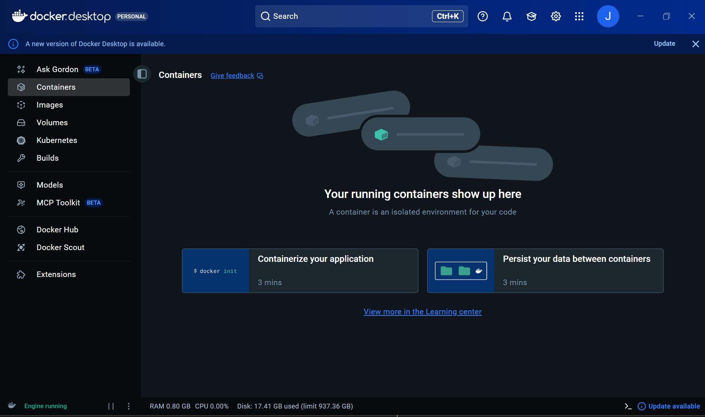
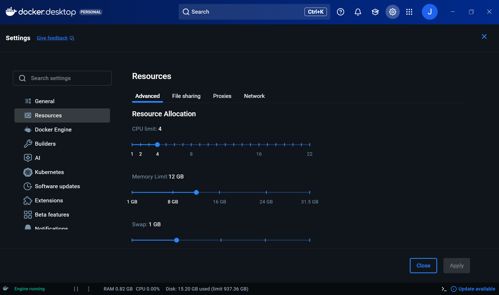
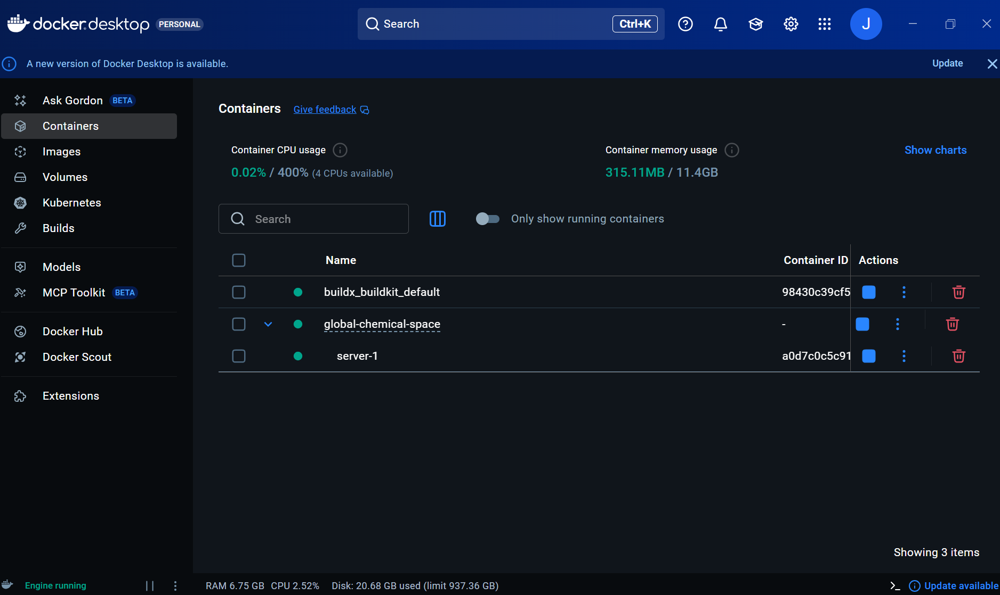
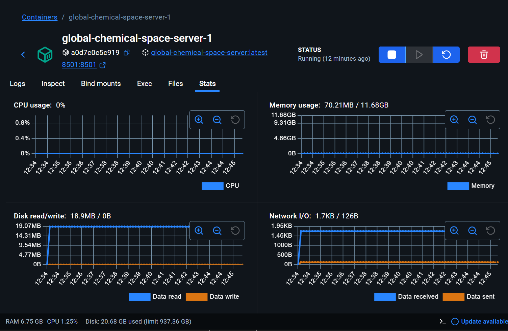
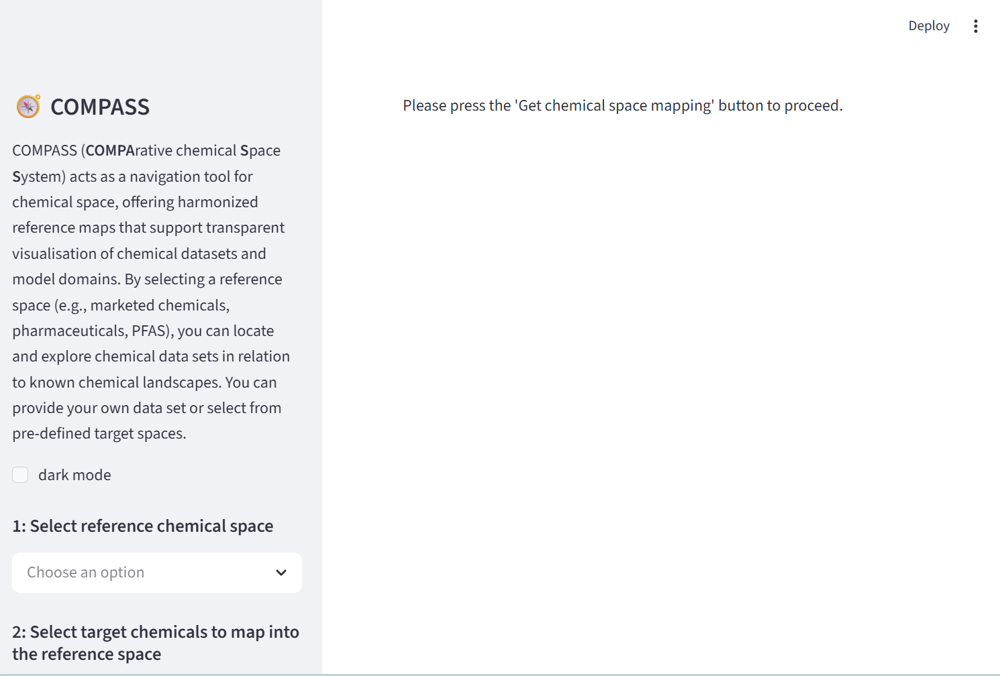
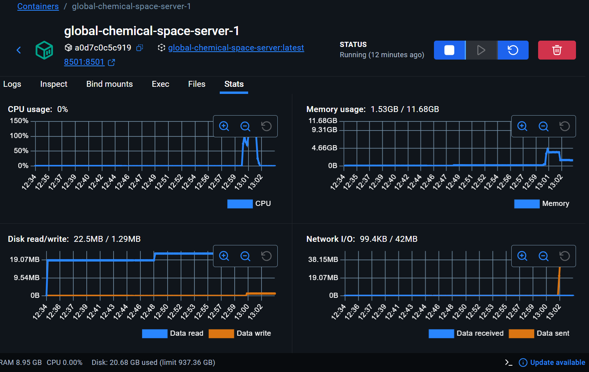

# 🧭 COMPASS

**COMPA**rative chemical **S**pace **S**ystem

A navigation tool for exploring chemical space through harmonized
reference maps.

COMPASS allows users to visualize chemical datasets within curated
reference spaces (e.g., DrugBank, PFAS, Coconut, AgroTrak), enabling
transparent exploration of chemical domains and model applicability.

------------------------------------------------------------------------

## 🌐 Demo Version (Web App)

A lightweight demo version of COMPASS is available online.
[click here](https://compass-demo.streamlit.app/)

The demo version:

-   ✔ Allows exploration of predefined reference spaces
-   ✔ Displays precomputed mappings
-   ✔ Provides interactive visualizations
-   ❌ Does **not** allow uploading custom datasets

If you want to visualize your own dataset on any reference space please use the 💻 Full Version (Local Execution) 


------------------------------------------------------------------------

## 💻 Full Version (Local Execution)

The full version of COMPASS enables:

-   ✔ Uploading your own chemical datasets
-   ✔ Structure standardization
-   ✔ Fingerprint calculation
-   ✔ Projection into reference chemical spaces
-   ✔ Generation of new coordinates using trained models

Because these operations require significant computational resources
(memory, model loading, preprocessing), they are intentionally disabled
in the web demo. 

Here we explain how to use it locally &#8595;

------------------------------------------------------------------------

# 🚀 Running the Full Version Locally (Docker)

## 1️⃣ Install Docker

We use Docker to facilitate a smooth installation of all requirements and to minimize problems related to the operating system and user-specific configurations. 

If you have never used docker please download and install it. 
Download Docker:\
https://docs.docker.com/get-docker/

After you complete the installation configure the resources: let Docker Desktop open. It should look a bit like this:



------------------------------------------------------------------------

## 2️⃣ Configure Docker 

Go to Settings>Resources:



We recommend that the Memory Limit is above 10 GB to prevent the app from quitting unexpectedely. For CPU we recommend 2-4. 

The section of this app which consumes most resources is to project your dataset into a reference space with a pre-trained model. The larger the reference space is the larger the memory requirement is. With the current implementation the most resource demanding operation is to use COCONUT as the reference space. 

If you don't have such resources you can still use smaller references spaces such as PFAS or DrugBank. 

See *Resource Considerations* to know what to do in case the app crashes. 

Save changes in Settings and keep Docker running

------------------------------------------------------------------------

## 3️⃣ Clone the Repository


``` bash
git clone https://github.com/BoCHemia/global-chemical-space.git
cd global-chemical-space
```

------------------------------------------------------------------------

## 4️⃣ Download Data & Models

Run:

``` bash
download.bat
```

This will automatically fetch required data and trained models from
Zenodo.

> ⚠️ Note: The full version requires the complete `data/`,  `models/` and `config/`
> folders.
Please confirm that these folders exist and that they are located in the same level as `modules/` and `app.py` 
------------------------------------------------------------------------

## 5️⃣ Start the Application

``` bash
docker compose up server
```

This will build the image and create a container. When this process is finished you should see something like this in your docker desktop:




By clicking on the container you can see logs, stats, files etc. We recommending checking stats to monitor the memory use.

You can also click on the 8501:8501 link to open the web app in your browser



The application will be available at:

http://localhost:8501

When the application starts it will fetch the relevant data from Zenodo. Please wait until this is completed to start using it. 

It should look like this:




------------------------------------------------------------------------

# 🏗 Architecture Overview

COMPASS is structured into two execution modes:

  Mode   Intended Use                  Upload Support   Model Execution
  ------ ----------------------------- ---------------- -----------------
  Demo   Web app / quick exploration   ❌ No            ❌ No
  Full   Local scientific use          ✔ Yes            ✔ Yes

The mode is controlled internally via environment configuration.

------------------------------------------------------------------------

# 📦 Data & Reproducibility

Precomputed demo assets are versioned and archived on Zenodo.

Full model artifacts and datasets are also available via Zenodo.

This ensures reproducibility and long-term availability.

------------------------------------------------------------------------

# 🔬 Intended Use

COMPASS is designed for:

-   Chemical space exploration
-   Transparency in model applicability
-   Comparative visualization of datasets
-   Research and regulatory analysis

------------------------------------------------------------------------

# ⚠️ Resource Considerations

The full version requires:

-   Substantial RAM (depending on dataset size)
-   RDKit and scientific Python stack
-   Local computation capabilities

The demo version is intentionally restricted to ensure stable hosting in
shared cloud environments.

If you are using the local version and it crashes unexpectedly while loading the model it is most likely a lack of Memory. 

Our recommendation would be: 
1. Close the app
2. From the terminal force stopping with Ctrl(Cmd) + C (twice)
3. Still from the terminal run ```docker compose down```
4. Using Docker desktop increase the Memory in  Docker>Settings>Resources>Memory
5. From the terminal build again by running ```docker compose up server```
6. Look carefully at the container stats to see if the Memory reaches a limit right before exiting. Once it exists the stats are normally lost so it is better to monitor it from the moment that you submit your data.

The screenshot below shows stats after projecting a private dataset on ZeroPM as a reference space. The memory peaked near 5GB



------------------------------------------------------------------------


## 🧪 Testing the Demo Version Locally (Developers)

To test the lightweight demo mode locally:

``` bash
docker compose up demo
```

This simulates the resource-constrained web deployment.

------------------------------------------------------------------------

# 📄 License

\[  CC BY 4.0 Attribution 4.0 International ]
Canonical URL https://creativecommons.org/licenses/by/4.0/


------------------------------------------------------------------------

# 📫 Contact

\[Jasmin Hafner: jasmin.hafner@eawag.ch] 

\[Jose Cordero: jose.cordero@eawag.ch]

\[Kerstin von Borries: kejbo@dtu.dk ]

\[Kathrin Fenner: kathrin.fenner@eawag.ch ]
